<div align="center">
  
  
  <br/>
  
  <sub><b>Real-time Facial Emotion Recognition system running CNN inference on webcam feed and test images</b></sub>
</div>

---

## 📁 Project Structure

```
Facial-Emotion/
├── run_test.bat                     ← Start webcam testing (shortcut)
├── run_image_test.bat               ← Start image testing (shortcut)
├── requirements.txt                 ← Python dependencies
├── .gitignore                       ← Excludes models and large datasets
├── main.py                          ← CNN model training and augmentation
├── test.py                          ← Real-time webcam detector
├── testdata.py                      ← Single static image analyzer
├── haarcascade_frontalface_default.xml  ← Haar Cascade face detector
└── Data/                            ← Local dataset folder (Excluded from Git)
    ├── train/                       ← Training subset sorted by emotions
    └── test/                        ← Validation subset sorted by emotions
```

---

## ⚙️ Step-by-Step Setup & Workflow Guide

Follow these steps to configure your environment, train the CNN model, and run emotion recognition inference:

### 1 · Clone the Repository
Clone this repository to your local machine and navigate into the project root:
```bash
git clone https://github.com/ChiranjibSaiChandanNath/Facial-Emotion-Recognization.git
cd Facial-Emotion-Recognization
```

### 2 · Create a Virtual Environment
Initialize a local Python virtual environment to manage dependencies isolated from your system packages:
```bash
# Create the virtual environment folder
python -m venv venv

# Activate the virtual environment:
# - On Windows (Command Prompt):
venv\Scripts\activate
# - On Windows (PowerShell):
venv\Scripts\Activate.ps1
# - On macOS/Linux:
source venv/bin/activate
```

### 3 · Install Project Dependencies
Use `pip` to install the required deep learning, image processing, and numerical packages listed in `requirements.txt`:
```bash
pip install -r requirements.txt
```

### 4 · Prepare the Dataset Structure
The dataset must be placed in a directory named `Data/` at the root of the project. 

> [!TIP]
> You can download the prepared dataset directly from **[Google Drive Dataset Link](https://drive.google.com/file/d/1oV8grnQY5m_slj_VybKI_SAdzHZLZsYS/view?usp=sharing)**. Once downloaded, extract and organize your training and testing images as follows:
```
Data/
├── train/
│   ├── Angry/
│   ├── Disgust/
│   ├── Fear/
│   ├── Happy/
│   ├── Neutral/
│   ├── Sad/
│   └── Surprise/
└── test/
    ├── Angry/
    ├── Disgust/
    └── ... (same subfolders for validation)
```

### 5 · Train the CNN & Generate `model_file.h5`
To train the Convolutional Neural Network on the images inside `Data/`:
```bash
python main.py
```
**What this script does:**
1. Loads training images from `Data/train` and validation images from `Data/test`.
2. Applies real-time data augmentation (rotations, zooms, horizontal flips) to expand and generalize the training dataset.
3. Builds the CNN structure (Conv2D -> MaxPooling -> Dropout -> Flatten -> Dense).
4. Fits the model, monitoring validation accuracy, and saves the best model states automatically.
5. Saves the final trained model weights as `model_file.h5` in the root folder.

### 6 · Run Facial Emotion Inference
To run inference, you need the trained model weights:
- **Option A (Pre-trained)**: Download the pre-trained **[model_file.h5 Weights](YOUR_GOOGLE_DRIVE_MODEL_LINK_HERE)** directly and place it in the root folder of the project.
- **Option B (Train from scratch)**: Run the training step (**Step 5** above) to generate `model_file.h5` yourself.

Once `model_file.h5` is in your root directory, run inference using the following scripts:

#### 📹 Option A: Real-Time Webcam Detection
Loads `model_file.h5` and checks your webcam feed for faces using `haarcascade_frontalface_default.xml`. It predicts the facial expression in real-time, outlining faces with color-coded bounding boxes.
- **Run via Command Line**:
  ```bash
  python test.py
  ```
- **Run via Windows Shortcut**:
  Double-click `run_test.bat`.

*Press **Q** on your keyboard to release the camera and exit the webcam interface.*

#### 🖼️ Option B: Static Image Inference
Loads `model_file.h5` and performs emotion classification on a specific image.
- **Run via Command Line**:
  ```bash
  python testdata.py path_to_image.jpg
  ```
- **Run via Windows Shortcut**:
  Double-click `run_image_test.bat` (which runs `testdata.py` on the default `img2.jpeg` image).

---

## 🧬 Model Architecture

```
1. Input Layer: Grayscale Images (48 x 48 x 1)
2. Conv2D (32 filters, 3x3 kernel, ReLU)
3. Conv2D (64 filters, 3x3 kernel, ReLU) -> MaxPooling2D -> Dropout(10%)
4. Conv2D (128 filters, 3x3 kernel, ReLU) -> MaxPooling2D -> Dropout(10%)
5. Conv2D (256 filters, 3x3 kernel, ReLU) -> MaxPooling2D -> Dropout(10%)
6. Flatten Layer
7. Fully Connected Dense Layer (512 units, ReLU) -> Dropout(20%)
8. Output Classification Layer (7 units, Softmax)
```

---

## 🎭 Emotion Classification Mapping

<!-- Animated confidence scale SVG -->
<div align="center">
<svg xmlns="http://www.w3.org/2000/svg" width="500" height="36" viewBox="0 0 500 36">
  <defs>
    <linearGradient id="emotionGrad" x1="0" y1="0" x2="1" y2="0">
      <stop offset="0%"   stop-color="#00ffe7"/>
      <stop offset="20%"  stop-color="#00ff88"/>
      <stop offset="40%"  stop-color="#f5a623"/>
      <stop offset="60%"  stop-color="#ff7c2a"/>
      <stop offset="80%"  stop-color="#ff3c6e"/>
      <stop offset="100%" stop-color="#ff00ff"/>
    </linearGradient>
  </defs>
  <!-- Track -->
  <rect x="10" y="14" width="480" height="8" rx="4" fill="rgba(255,255,255,0.05)" stroke="rgba(255,255,255,0.1)" stroke-width="0.5"/>
  <!-- Animated fill -->
  <rect x="10" y="14" width="0" height="8" rx="4" fill="url(#emotionGrad)">
    <animate attributeName="width" from="0" to="480" dur="2s" begin="0.5s" fill="freeze"/>
  </rect>
  <!-- Labels -->
  <text x="10"  y="9" font-family="monospace" font-size="7" fill="#00ffe7">NEUTRAL</text>
  <text x="105" y="9" font-family="monospace" font-size="7" fill="#00ff88" text-anchor="middle">HAPPY</text>
  <text x="200" y="9" font-family="monospace" font-size="7" fill="#f5a623" text-anchor="middle">SURPRISE</text>
  <text x="295" y="9" font-family="monospace" font-size="7" fill="#ff7c2a" text-anchor="middle">FEAR / SAD</text>
  <text x="480" y="9" font-family="monospace" font-size="7" fill="#ff3c6e" text-anchor="end">ANGRY / DISGUST</text>
  <!-- Tick marks -->
  <line x1="105" y1="12" x2="105" y2="24" stroke="#00ff88" stroke-width="0.8" stroke-opacity="0.6"/>
  <line x1="200" y1="12" x2="200" y2="24" stroke="#f5a623" stroke-width="0.8" stroke-opacity="0.6"/>
  <line x1="295" y1="12" x2="295" y2="24" stroke="#ff7c2a" stroke-width="0.8" stroke-opacity="0.6"/>
</svg>
</div>

<br/>

The system detects facial landmarks and draws visual color boxes specific to each emotion:

| Index | Emotion | Bounding Box Color | Color Representation (RGB) |
|:-----:|:-------:|:------------------:|:--------------------------:|
| **0** | 🔴 Angry | Red | `(0, 0, 255)` |
| **1** | 🟠 Disgust | Orange | `(0, 140, 255)` |
| **2** | 🟡 Fear | Yellow | `(0, 255, 255)` |
| **3** | 🟢 Happy | Green | `(0, 255, 0)` |
| **4** | ⚪ Neutral | White | `(255, 255, 255)` |
| **5** | 🔵 Sad | Blue | `(255, 0, 0)` |
| **6** | 🟣 Surprise | Magenta | `(255, 0, 255)` |

---

## 📈 Performance & Tuning

- **Grayscale Normalization**: Pixel values are rescaled `1./255` prior to input.
- **Data Augmentation**: Shear, zoom, rotation, and flips are applied during training to prevent overfitting.
- **Dynamic Checkpoint**: Callback saves the best performing weights to `model_file.h5` based on validation accuracy (`ModelCheckpoint`).

---

<div align="center">

<!-- Animated bottom banner SVG -->
<svg xmlns="http://www.w3.org/2000/svg" width="600" height="48" viewBox="0 0 600 48">
  <defs>
    <linearGradient id="bannerGrad" x1="0" y1="0" x2="1" y2="0">
      <stop offset="0%" stop-color="#00ffe7" stop-opacity="0"/>
      <stop offset="25%" stop-color="#00ffe7" stop-opacity="0.6"/>
      <stop offset="75%" stop-color="#00ffe7" stop-opacity="0.6"/>
      <stop offset="100%" stop-color="#00ffe7" stop-opacity="0"/>
    </linearGradient>
  </defs>
  <!-- Top line -->
  <rect x="0" y="0" width="600" height="1" fill="url(#bannerGrad)"/>
  <!-- Bottom line -->
  <rect x="0" y="47" width="600" height="1" fill="url(#bannerGrad)"/>
  <!-- Text -->
  <text x="300" y="20" font-family="'Courier New', monospace" font-size="11"
    fill="#00ffe7" text-anchor="middle" letter-spacing="4" opacity="0.9">
    EMOTION RECOGNITION 2026
    <animate attributeName="opacity" values="0.5;1;0.5" dur="3s" repeatCount="indefinite"/>
  </text>
  <text x="300" y="38" font-family="'Courier New', monospace" font-size="9"
    fill="#4a6a8a" text-anchor="middle" letter-spacing="3">
    COMPUTER VISION &amp; DEEP LEARNING
  </text>
  <!-- Corner accents -->
  <path d="M8,4 L4,4 L4,14" fill="none" stroke="#00ffe7" stroke-width="1" opacity="0.6"/>
  <path d="M592,4 L596,4 L596,14" fill="none" stroke="#00ffe7" stroke-width="1" opacity="0.6"/>
  <path d="M8,44 L4,44 L4,34" fill="none" stroke="#00ffe7" stroke-width="1" opacity="0.6"/>
  <path d="M592,44 L596,44 L596,34" fill="none" stroke="#00ffe7" stroke-width="1" opacity="0.6"/>
</svg>

<br/><br/>


</div>
